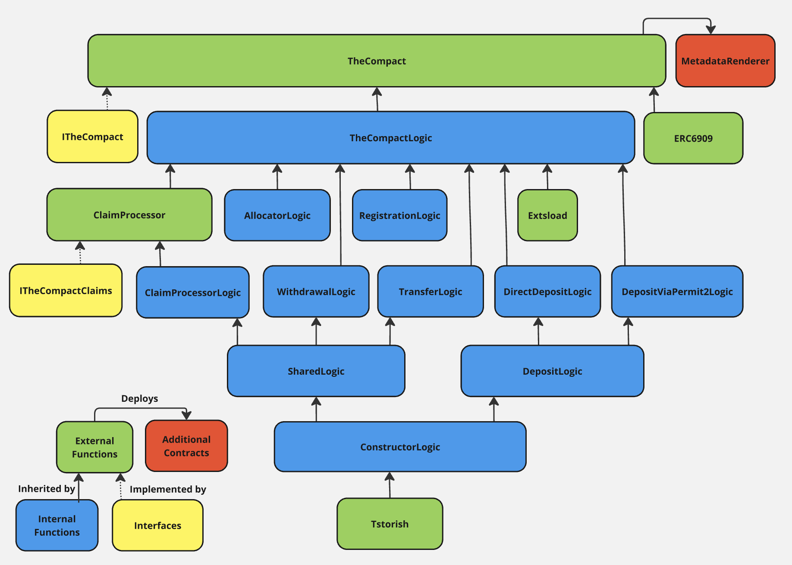

# The Compact 🤝
 - **Compact** *[noun]*: an agreement or covenant between two or more parties.
 - **Compact** *[transitive verb]*: to make up by connecting or combining.
 - **Compact** *[adjective]*: occupying a small volume by reason of efficient use of space.

[](https://github.com/Uniswap/the-compact/actions/workflows/test.yml)[]([https://codecov.io/gh/uniswap/the-compact](https://app.codecov.io/gh/uniswap/the-compact/tree/v1))[](https://github.com/Uniswap/the-compact/blob/v1/docs/TheCompact-Overview.md)

> :warning: This is an early-stage contract under active development; it has not yet been properly tested, reviewed, or audited.

> NOTE: this README is based on Version 0 of The Compact; it still needs to be updated for Version 1, which is currently under active development.

## Summary
The Compact is an ownerless ERC6909 contract that facilitates the voluntary formation (and, if necessary, eventual dissolution) of reusable resource locks.

Resource locks are entered into by ERC20 or native token holders, called the _**depositor**_. Once a resource lock has been established, the owner of the ERC6909 token representing a resource lock can act as a _**sponsor**_ and create a _**compact**_. A compact is a commitment allowing interested parties to claim their tokens through the sponsor's indicated _**arbiter**_. The arbiter is then responsible for processing the claim once it has attested to the specified conditions of the compact having been met.

Each resource lock is mediated by an _**allocator**_, tasked with attesting to the availability of the underlying token balances and preserving the balances required for the commitments they have attested to; in other words, an allocator ensures that sponsors do not "double-spend," transfer, or withdraw any token balances that are already committed to a specific compact.

Once a sponsor and their designated allocator have both committed to a compact, a _**claimant**_ may then immediately perform the attached condition (such as delivering another token on some destination chain) and then claim the allocated tokens by initiating a call to the associated arbiter, which will verify and mediate the terms and conditions of the associated compact and relay the confirmation to process the claim.

The Compact effectively "activates" any deposited tokens to be instantly spent or swapped across arbitrary, asynchronous environments as long as:
 - the claimant is confident that the allocator is sound and will not leave the resource lock underallocated,
 - the sponsor is confident that the arbiter is sound and will not process claims where the conditions were not successfully met,
 - the claimant is confident that the arbiter is sound and will not *fail* to process claims where the conditions *were* successfully met, and
 - the sponsor is confident that the allocator will not unduly censor fully allocated requests.

Sponsors have recourse from potential censorship in the form of a "forced withdrawal." When depositing tokens into a resource lock, the sponsor provides a "reset period" as a parameter. Then, the sponsor can initiate a forced withdrawal at any point; after the reset period has elapsed, the full token balance can be withdrawn regardless of any pending claims on their balance. In the case of cross-chain swaps, reset periods only need to be long enough for the claim to finalize (generally some multiple of the slowest blockchain involved in the swap).

Claimants must bear varying degrees of trust assumptions with regards to allocators, with the potential design space including reputation-based systems, trusted execution environments, smart-contract-based systems, or even dedicated rollups. The Compact takes a neutral stance on implementations of both allocators and arbiters, enabling support for a wide variety of potential applications while ensuring adherence to a consistent interface when integrating with the system as a whole.

## Setup
```
# install foundry if needed
$ curl -L https://foundry.paradigm.xyz | bash

# clone repo
$ git clone git@github.com:Uniswap/the-compact.git && cd the-compact

# install dependencies & libraries
$ forge install

# run basic tests & gas snapshots
$ forge test

# run coverage & generate report
$ forge coverage --report lcov
```

## Usage
Version 0 of The Compact is currently deployed on mainnet, Sepolia, Unichain, Unichain Sepolia, Optimism, OP Sepolia, Base, and Base Sepolia at `0x00000000000018DF021Ff2467dF97ff846E09f48`. As long as the prerequisite deployer contract and Permit2 are deployed to a given chain, The Compact can be deployed to any new chain by running `forge script script/TheCompact.s.sol`.

### 1) Register an Allocator
To begin using The Compact, an allocator must first be registered on the contract. Anyone can register any account as an allocator by calling the `__register` function as long as one of the following requirements are met:
 - the allocator being registered is the caller
 - the allocator being registered is a contract with code deployed to it
 - a `CREATE2` address derivation proof for the allocator's address is provided as part of the call.

Once an allocator has been registered on a given chain for the first time, it will be assigned a 92-bit "allocator ID" that resource locks will use to reference it.

> Note that multiple allocators may register the same allocator ID across different chains if their addresses are very similar; a mechanic for collision resistance is available whereby the number of leading zero "nibbles" above three is encoded in the first four bits of the allocator ID. This implies that any allocator with nine leading zero bytes has a unique allocator ID.

A given allocator only needs to be registered once per chain and can then be utilized by many different resource locks.

The allocator's primary function is to ensure that any resource locks it is assigned to are not "double-spent" — this entails ensuring that sufficient unallocated balance is available before cosigning on any requests to withdraw or transfer the balance or to sponsor a claim on that balance, and also ensuring that nonces are not reused. Allocators can also call a `consume` method at any point to consume nonces so that they cannot be used again.

### 2) Deposit tokens
To enter into The Compact and create resource locks, a depositor begins by selecting for their four preferred properties for the lock:
 - the _**underlying token**_ held in the resource lock
 - the _**allocator**_ tasked with cosigning on claims against the resource locks and ensuring that the resource lock is not "double-spent" in any capacity, indicated by its registered allocator ID
 - the _**scope**_ of the resource lock (either spendable on any chain or limited to a single chain, with a default option of being spendable on any chain)
 - the _**reset period**_ for forceably exiting the lock and withdrawing the funds without the allocator's approval (one of eight preset values ranging from one second to thirty days, with a default option of ten minutes)

Each unique combination of these four properties is represented by a fungible ERC6909 tokenID.

Depending on the selected properties of the resource lock, the number of tokens being placed into resource locks, and the source of token allowances for those tokens, the depositor then calls one of seven `deposit` functions:
 - a basic, payable deposit function that uses native tokens and the default scope and reset period parameters and supplies an allocator for the resource lock, where the caller is the recipient of the 6909 tokens representing ownership of the lock
 - a basic, non-payable deposit function that supplies an ERC20 token (with sufficient allowance set directly on The Compact) and amount to deposit in the resource lock, along with an allocator and the default scope and reset period parameters, where the caller is the recipient of the 6909 tokens representing ownership of the lock
 - a payable deposit function that uses native tokens and specifies the allocator, the scope, the reset period, and the recipient of the 6909 tokens representing ownership of the lock
  - a non-payable deposit function that supplies an ERC20 token (with sufficient allowance set directly on The Compact) and amount to deposit in the resource lock, and that specifies the allocator, the scope, the reset period, and the recipient of the 6909 tokens representing ownership of the lock
 - a payable deposit function that specifies an array of 6909 IDs representing resource locks and deposit amounts for each id (with sufficient allowance set directly on The Compact for each ERC20 token) and the recipient of the 6909 tokens representing ownership of each lock
 - a non-payable deposit function that supplies an ERC20 token, amount, and associated Permit2 signature data (with sufficient allowance set on Permit2), and that specifies the allocator, the scope, the reset period, and the recipient of the 6909 tokens representing ownership of the lock (all of which are included as part of the Permit2 witness)
 - a payable deposit function that supplies an array of tokens and amounts (including an optional native token followed by any number of ERC20 tokens), and associated Permit2 batch signature data (with sufficient allowance set on Permit2 for each ERC20 token), and that specifies the allocator, the scope, the reset period, and the recipient of the 6909 tokens representing ownership of each lock (all of which are included as part of the Permit2 witness).

There are also five `depositAndRegister` functions that simultaneously perform a deposit into a resource lock and register a compact (see section 3b).

 > For ERC20 deposits, the amount of 6909 tokens minted is based on the change in the actual token balance held by The Compact after making the deposit, not the supplied amount; this enables support for making deposits of fee-on-transfer tokens where the fee is deducted from the recipient.

As long as allocators generally operate in an honest and reliable manner, this is the only direct interaction that end users will need to take; furthermore, in the case of the Permit2 deposit methods, the interaction can be made in a gasless fashion (where another party relays the signed message on behalf of the depositor).

### X) Perform a Forced Withdrawal
At any point after depositing tokens, if an allocator goes down or refuses to cosign for a given claim against a resource lock, the depositor can initiate and process a forced withdrawal subject to the reset period on the resource lock.

First, the depositor calls `enableForcedWithdrawal` and supplies the ID of the associated resource lock. At this point, their allocator will almost certainly cease cosigning for any sponsored claims from that depositor, and fillers will similarly avoid fulfilling new claim requests, but any inflight claims will still be able to be processed as long as the reset period on the resource lock is sufficient.

Next, the depositor calls `forcedWithdrawal` and supplies the id, amount, and recipient; assuming the reset period has transpired from the point when the forced withdrawal was enabled, the underlying tokens will be sent to the recipient and a corresponding amount of 6909 tokens held by the caller will be burned.

 > For ERC20 withdrawals, the amount of 6909 tokens burned is based on the change in the actual token balance held by The Compact after making the withdrawal, not the supplied amount; this enables support for making withdrawals of fee-on-transfer tokens where the fee is deducted from the sender.

 Finally, if the original depositor wants to "reactivate" the resource lock, they can call `disableForcedWithdrawal` and supply the ID of the resource lock, returning the lock to the default state and preventing forced withdrawals until it is reactivated again.

### Y) Perform a Standard Transfer
Each ERC6909 token ID representing a specific set of resource lock parameters can be transferred like any other token; however, there is one additional requirement that must be met. The Compact will perform a call to the allocator before performing the transfer, and that allocator must attest to the transfer before it can proceed; this is necessary to prevent the invalidation of inflight claims on the resource lock.

```solidity
interface IAllocator {
    // Called on standard transfers; must return this function selector (0x1a808f91).
    function attest(
        address operator,
        address from,
        address to,
        uint256 id,
        uint256 amount
    ) external returns (bytes4);
}
```

> Note: this is a stateful callback; care must be taken on the part of the allocator to avoid situations that could lead to an overallocated outcome via reentrancy or other unintended side effects.

### 3) Create a Compact
Once a resource lock (or group of resource locks) has been established, the owner of the lock can enter into an agreement where the resource lock (or resource locks) will become claimable upon meeting the specified conditions.

 ### 3a) Sign a Compact
 In the default case, the owner and allocator of a resource lock both agree on a given course of action and attest to it by signing one of three EIP-712 payloads:
  - a **Compact** deals with a specific resource lock and designates an **arbiter** tasked with verifying that the necessary conditions have been met choosing which accounts will receive the tokens and in what quantities
  - a **BatchCompact** deals with a set of resource locks on a single chain and also designates an arbiter
  - a **MultichainCompact** deals with a set of resource locks across multiple chains and designates a distinct arbiter for each chain.

In this context, the owner is referred to as the **sponsor** as they are sponsoring a claim against the resource lock, and each beneficiary or recipient of a portion of the claim is referred to as a **claimant**.

```solidity
// Message signed by the sponsor that specifies the conditions under which their
// tokens can be claimed; the specified arbiter verifies that those conditions
// have been met and specifies a set of beneficiaries that will receive up to the
// specified amount of tokens.
struct Compact {
    address arbiter; // The account tasked with verifying and submitting the claim.
    address sponsor; // The account to source the tokens from.
    uint256 nonce; // A parameter to enforce replay protection, scoped to allocator.
    uint256 expires; // The time at which the claim expires.
    uint256 id; // The token ID of the ERC6909 token to allocate.
    uint256 amount; // The amount of ERC6909 tokens to allocate.
    // Optional witness may follow.
}

// Message signed by the sponsor that specifies the conditions under which a set of
// tokens, each sharing an allocator, can be claimed; the specified arbiter verifies
// that those conditions have been met and specifies a set of beneficiaries that will
// receive up to the specified amounts of each token.
struct BatchCompact {
    address arbiter; // The account tasked with verifying and submitting the claim.
    address sponsor; // The account to source the tokens from.
    uint256 nonce; // A parameter to enforce replay protection, scoped to allocator.
    uint256 expires; // The time at which the claim expires.
    uint256[2][] idsAndAmounts; // The allocated token IDs and amounts.
    // Optional witness may follow.
}

// A multichain compact can declare tokens and amounts to allocate from multiple chains,
// each designated by their chainId. Any allocated tokens on an exogenous domain (e.g. all
// but the first element) must designate the Multichain scope. Each element may designate
// a unique arbiter for the chain in question. Note that the witness data is distinct for
// each element, but all elements must share the same EIP-712 "Mandate" witness typestring.
struct Element {
    address arbiter; // The account tasked with verifying and submitting the claim.
    uint256 chainId; // The chainId where the tokens are located.
    uint256[2][] idsAndAmounts; // The allocated token IDs and amounts.
    // Mandate witness will follow.
}

// Message signed by the sponsor that specifies the conditions under which a set of
// tokens across a number of different chains can be claimed; the specified arbiter on
// each chain verifies that those conditions have been met and specifies a set of
// beneficiaries that will receive up to the specified amounts of each token.
struct MultichainCompact {
    address sponsor; // The account to source the tokens from.
    uint256 nonce; // A parameter to enforce replay protection, scoped to allocator.
    uint256 expires; // The time at which the claim expires.
    Element[] elements; // Arbiter, chainId, ids & amounts, and witness for each chain.
}
```

To be considered valid, each compact must meet the following requirements:
 - the arbiter must submit the call (`arbiter == msg.sender`)
 - the sponsor must sign the EIP-712 payload (either ECDSA or EIP-1271) or submit the call (i.e. `arbiter == sponsor`)
 - the allocator must sign the EIP-712 payload (either ECDSA or EIP-1271) or a qualified payload referencing it, or submit the call (i.e. `arbiter == allocator`)
 - the compact cannot be expired (`expires > block.timestamp`)
 - the nonce cannot have been used previously

Once this payload has been signed by both the sponsor and the allocator (or at least by one party if the other is the intended caller), a claim can be submitted against it by the designated arbiter using a wide variety of functions (104 to be exact) depending on the type of compact and the intended result.

### 3b) Submit a Compact Directly
Alternatively, the sponsor can register a compact (or group of compacts) by submitting a "claim hash" along with the typehash of the underlying compact (which maps to the EIP-712 message hash that would otherwise have been signed). Then, instead of supplying the signature of the sponsor as part of a claim, The Compact derives the claim hash based on the claim being submitted and attempts to locate a matching registered claim hash with the correct typehash. This flow supports more advanced functionality, such as sponsors without the ability to sign (like protocols or DAOs), smart wallet / EIP7702-enabled sponsors that have their own authorization or batching logic, and chained deposit & register operations. When registering a compact directly, a duration is either explicitly provided or inferred from the reset period on the corresponding deposit where available; the registered compact becomes inactive once that duration elapses.

> Note: once registered, a compact cannot be unregistered. The only way to definitively cancel a registered compact is by either having the allocator consume the attached nonce or waiting for the registered compact to expire. Alternatively, the sponsor may perform a forced withdrawal to render the compact unclaimable until tokens are placed back into the resource lock.

### 4) Submit a Claim
An arbiter takes a signed compact designated to them and uses it to submit a claim to The Compact.

### 4a) Allocated Transfer & Allocated Withdrawal
In the most straightforward variety of claim, where the arbiter is the sponsor, there are three key factors that result in eight distinct endpoints:
 - transfer vs. withdrawal: whether to transfer the ERC6909 tokens directly, or to withdraw the underlying tokens (e.g. calling `allocatedTransfer` or `allocatedWithdrawal`)
 - whether or not to perform a "split": with no split, the caller specifies a single recipient, whereas with a split the caller specifies multiple recipients and respective amounts
 - whether or not the compact in question is a "batch" compact: with a batch compact, multiple resource locks and respective amounts are involved in the claim.

 ```solidity
struct BasicTransfer {
    bytes allocatorData; // Authorization from the allocator.
    uint256 nonce; // A parameter to enforce replay protection, scoped to allocator.
    uint256 expires; // The time at which the transfer or withdrawal expires.
    uint256 id; // The token ID of the ERC6909 token to transfer or withdraw.
    uint256 amount; // The token amount to transfer or withdraw.
    address recipient; // The recipient of the transfer or withdrawal.
}

struct SplitTransfer {
    bytes allocatorData; // Authorization from the allocator.
    uint256 nonce; // A parameter to enforce replay protection, scoped to allocator.
    uint256 expires; // The time at which the transfer or withdrawal expires.
    uint256 id; // The token ID of the ERC6909 token to transfer or withdraw.
    SplitComponent[] recipients; // The recipients and amounts of each transfer.
}

struct SplitComponent {
    address claimant; // The recipient of the transfer or withdrawal.
    uint256 amount; // The amount of tokens to transfer or withdraw.
}

struct BatchTransfer {
    bytes allocatorData; // Authorization from the allocator.
    uint256 nonce; // A parameter to enforce replay protection, scoped to allocator.
    uint256 expires; // The time at which the transfer or withdrawal expires.
    TransferComponent[] transfers; // The token IDs and amounts to transfer.
    address recipient; // The recipient of the batch transfers.
}

struct TransferComponent {
    uint256 id; // The token ID of the ERC6909 token to transfer or withdraw.
    uint256 amount; // The token amount to transfer or withdraw.
}

struct SplitBatchTransfer {
    bytes allocatorData; // Authorization from the allocator.
    uint256 nonce; // A parameter to enforce replay protection, scoped to allocator.
    uint256 expires; // The time at which the transfer or withdrawal expires.
    SplitByIdComponent[] transfers; // The recipients and amounts of each transfer for each ID.
}

struct SplitByIdComponent {
    uint256 id; // The token ID of the ERC6909 token to transfer or withdraw.
    SplitComponent[] portions; // claimants and amounts.
}

 interface ICompactAllocatedTransferAndWithdrawal {
    function allocatedTransfer(BasicTransfer calldata transfer) external returns (bool);
    function allocatedWithdrawal(BasicTransfer calldata withdrawal) external returns (bool);
    function allocatedTransfer(SplitTransfer calldata transfer) external returns (bool);
    function allocatedWithdrawal(SplitTransfer calldata withdrawal) external returns (bool);
    function allocatedTransfer(BatchTransfer calldata transfer) external returns (bool);
    function allocatedWithdrawal(BatchTransfer calldata withdrawal) external returns (bool);
    function allocatedTransfer(SplitBatchTransfer calldata transfer) external returns (bool);
    function allocatedWithdrawal(SplitBatchTransfer calldata withdrawal) external returns (bool);
 }
 ```

### 4b) Single Resource Lock Claims
When the arbiter is *not* necessarily the sponsor, and when the sponsor is only utilizing a single resource lock on a specific chain, the sponsor will sign a `Compact` EIP-712 payload. From that starting point, there are four key factors that result in sixteen distinct endpoints using two function names and eight input struct types:
 - transfer vs. withdrawal: whether to transfer the claimed ERC6909 tokens directly, or to withdraw the underlying claimed tokens (e.g. calling `claim` or `claimAndWithdraw`)
 - unqualified vs qualified: whether the allocator is cosigning the same claim hash as the sponsor, or if they are signing for additional data. This can be an arbitrary EIP-712 payload, with one exception: the first element must be the claim hash, which will be provided by The Compact directly as part of signature verification. These claims take two additional arguments: the EIP-712 typehash used in the qualification, and the data payload (not including the first claim hash argument). This data can then be utilized by the arbiter to inform and constrain the claim.
 - no witness vs. witness: whether or not the sponsor has elected to extend the Compact EIP-712 payload with an additional witness argument (generally using a new struct). When witness data is utilized, the call takes two additional arguments: one representing the EIP-712 hash of the witness data (or the direct data if it is a single value) and one representing the additional EIP-712 typestring that will extend the default arguments to include the witness.
 - whether or not to perform a "split": with no split, the caller specifies a single recipient, whereas with a split the caller specifies multiple recipients and respective amounts.


```solidity
struct AllClaimsStartWith {
    bytes allocatorData; // Authorization from the allocator.
    bytes sponsorSignature; // Authorization from the sponsor.
    address sponsor; // The account to source the tokens from.
    uint256 nonce; // A parameter to enforce replay protection, scoped to allocator.
    uint256 expires; // The time at which the claim expires.
    // rest of the parameters follow ...
}

struct BasicClaim {
    bytes allocatorData; // Authorization from the allocator.
    bytes sponsorSignature; // Authorization from the sponsor.
    address sponsor; // The account to source the tokens from.
    uint256 nonce; // A parameter to enforce replay protection, scoped to allocator.
    uint256 expires; // The time at which the claim expires.
    uint256 id; // The token ID of the ERC6909 token to allocate.
    uint256 allocatedAmount; // The original allocated amount of ERC6909 tokens.
    address claimant; // The claim recipient; specified by the arbiter.
    uint256 amount; // The claimed token amount; specified by the arbiter.
}

struct QualifiedClaim {
    // ... same first 5 parameters as all claims
    bytes32 qualificationTypehash; // Typehash of the qualification payload.
    bytes qualificationPayload; // Data used to derive qualification hash.
    // ... same last 4 parameters as BasicClaim
}

struct ClaimWithWitness {
    // ... same first 5 parameters as all claims
    bytes32 witness; // Hash of the witness data.
    string witnessTypestring; // Witness typestring appended to existing typestring.
    // ... same last 4 parameters as BasicClaim
}

struct QualifiedClaimWithWitness {
    // ... same first 5 parameters as all claims
    bytes32 witness; // Hash of the witness data.
    string witnessTypestring; // Witness typestring appended to existing typestring.
    bytes32 qualificationTypehash; // Typehash of the qualification payload.
    bytes qualificationPayload; // Data used to derive qualification hash.
    // ... same last 4 parameters as BasicClaim
}

struct SplitClaim {
    // ... same first 5 parameters as all claims
    uint256 id; // The token ID of the ERC6909 token to allocate.
    uint256 allocatedAmount; // The original allocated amount of ERC6909 tokens.
    SplitComponent[] claimants; // The claim recipients and amounts; specified by the arbiter.
}

struct QualifiedSplitClaim {
    // ... same first 5 parameters as all claims
    bytes32 qualificationTypehash; // Typehash of the qualification payload.
    bytes qualificationPayload; // Data used to derive qualification hash.
    // ... same last 3 parameters as SplitClaim
}

struct SplitClaimWithWitness {
    // ... same first 5 parameters as all claims
    bytes32 witness; // Hash of the witness data.
    string witnessTypestring; // Witness typestring appended to existing typestring.
    // ... same last 3 parameters as SplitClaim
}

struct QualifiedSplitClaimWithWitness {
    // ... same first 5 parameters as all claims
    bytes32 witness; // Hash of the witness data.
    string witnessTypestring; // Witness typestring appended to existing typestring.
    bytes32 qualificationTypehash; // Typehash of the qualification payload.
    bytes qualificationPayload; // Data used to derive qualification hash.
    // ... same last 3 parameters as SplitClaim
}

interface ICompactClaims {
    function claim(BasicClaim calldata claimPayload) external returns (bool);
    function claimAndWithdraw(BasicClaim calldata claimPayload) external returns (bool);
    function claim(QualifiedClaim calldata claimPayload) external returns (bool);
    function claimAndWithdraw(QualifiedClaim calldata claimPayload) external returns (bool);
    function claim(ClaimWithWitness calldata claimPayload) external returns (bool);
    function claimAndWithdraw(ClaimWithWitness calldata claimPayload) external returns (bool);
    function claim(QualifiedClaimWithWitness calldata claimPayload) external returns (bool);
    function claimAndWithdraw(QualifiedClaimWithWitness calldata claimPayload) external returns (bool);
    function claim(SplitClaim calldata claimPayload) external returns (bool);
    function claimAndWithdraw(SplitClaim calldata claimPayload) external returns (bool);
    function claim(QualifiedSplitClaim calldata claimPayload) external returns (bool);
    function claimAndWithdraw(QualifiedSplitClaim calldata claimPayload) external returns (bool);
    function claim(SplitClaimWithWitness calldata claimPayload) external returns (bool);
    function claimAndWithdraw(SplitClaimWithWitness calldata claimPayload) external returns (bool);
    function claim(QualifiedSplitClaimWithWitness calldata claimPayload) external returns (bool);
    function claimAndWithdraw(QualifiedSplitClaimWithWitness calldata claimPayload) external returns (bool);
}
```

### 4c) Multiple Resource Lock Claims for a Single Chain
When the sponsor is utilizing multiple resource locks on a specific chain, they will sign a `BatchCompact` EIP-712 payload. There are another sixteen endpoints that map to the same combination as the single-resource lock cases.

```solidity
struct BatchClaim {
    bytes allocatorData; // Authorization from the allocator.
    bytes sponsorSignature; // Authorization from the sponsor.
    address sponsor; // The account to source the tokens from.
    uint256 nonce; // A parameter to enforce replay protection, scoped to allocator.
    uint256 expires; // The time at which the claim expires.
    BatchClaimComponent[] claims; // IDs and amounts.
    address claimant; // The claim recipient; specified by the arbiter.
}

struct BatchClaimComponent {
    uint256 id; // The token ID of the ERC6909 token to allocate.
    uint256 allocatedAmount; // The original allocated amount of ERC6909 tokens.
    uint256 amount; // The claimed token amount; specified by the arbiter.
}

struct QualifiedBatchClaim {
    // ... same first 5 parameters as all claims
    uint256 expires; // The time at which the claim expires.
    bytes32 qualificationTypehash; // Typehash of the qualification payload.
    bytes qualificationPayload; // Data used to derive qualification hash.
    BatchClaimComponent[] claims; // IDs and amounts.
    address claimant; // The claim recipient; specified by the arbiter.
}

struct BatchClaimWithWitness {
    // ... same first 5 parameters as all claims
    bytes32 witness; // Hash of the witness data.
    string witnessTypestring; // Witness typestring appended to existing typestring.
    BatchClaimComponent[] claims; // IDs and amounts.
    address claimant; // The claim recipient; specified by the arbiter.
}

struct QualifiedBatchClaimWithWitness {
    // ... same first 5 parameters as all claims
    bytes32 witness; // Hash of the witness data.
    string witnessTypestring; // Witness typestring appended to existing typestring.
    bytes32 qualificationTypehash; // Typehash of the qualification payload.
    bytes qualificationPayload; // Data used to derive qualification hash.
    BatchClaimComponent[] claims; // IDs and amounts.
    address claimant; // The claim recipient; specified by the arbiter.
}

struct SplitBatchClaim {
    // ... same first 5 parameters as all claims
    SplitBatchClaimComponent[] claims; // The claim token IDs, recipients and amounts.
}

struct SplitBatchClaimComponent {
    uint256 id; // The token ID of the ERC6909 token to allocate.
    uint256 allocatedAmount; // The original allocated amount of ERC6909 tokens.
    SplitComponent[] portions; // claimants and amounts.
}

struct SplitBatchClaimWithWitness {
    // ... same first 5 parameters as all claims
    bytes32 witness; // Hash of the witness data.
    string witnessTypestring; // Witness typestring appended to existing typestring.
    SplitBatchClaimComponent[] claims; // The claim token IDs, recipients and amounts.
}

struct QualifiedSplitBatchClaim {
    // ... same first 5 parameters as all claims
    bytes32 qualificationTypehash; // Typehash of the qualification payload.
    bytes qualificationPayload; // Data used to derive qualification hash.
    SplitBatchClaimComponent[] claims; // The claim token IDs, recipients and amounts.
}

struct QualifiedSplitBatchClaimWithWitness {
    // ... same first 5 parameters as all claims
    bytes32 witness; // Hash of the witness data.
    string witnessTypestring; // Witness typestring appended to existing typestring.
    bytes32 qualificationTypehash; // Typehash of the qualification payload.
    bytes qualificationPayload; // Data used to derive qualification hash.
    SplitBatchClaimComponent[] claims; // The claim token IDs, recipients and amounts.
}

interface ICompactBatchClaims {
    function claim(BatchClaim calldata claimPayload) external returns (bool);
    function claimAndWithdraw(BatchClaim calldata claimPayload) external returns (bool);
    function claim(QualifiedBatchClaim calldata claimPayload) external returns (bool);
    function claimAndWithdraw(QualifiedBatchClaim calldata claimPayload) external returns (bool);
    function claim(BatchClaimWithWitness calldata claimPayload) external returns (bool);
    function claimAndWithdraw(BatchClaimWithWitness calldata claimPayload) external returns (bool);
    function claim(QualifiedBatchClaimWithWitness calldata claimPayload) external returns (bool);
    function claimAndWithdraw(QualifiedBatchClaimWithWitness calldata claimPayload) external returns (bool);
    function claim(SplitBatchClaim calldata claimPayload) external returns (bool);
    function claimAndWithdraw(SplitBatchClaim calldata claimPayload) external returns (bool);
    function claim(QualifiedSplitBatchClaim calldata claimPayload) external returns (bool);
    function claimAndWithdraw(QualifiedSplitBatchClaim calldata claimPayload) external returns (bool);
    function claim(SplitBatchClaimWithWitness calldata claimPayload) external returns (bool);
    function claimAndWithdraw(SplitBatchClaimWithWitness calldata claimPayload) external returns (bool);
    function claim(QualifiedSplitBatchClaimWithWitness calldata claimPayload) external returns (bool);
    function claimAndWithdraw(QualifiedSplitBatchClaimWithWitness calldata claimPayload) external returns (bool);
}
```

#### 4c) Single Resource Lock Claim on Multiple Chains
When the sponsor wants to utilize multiple resource locks where each lock is on its own chain, they will sign a `MultichainCompact` EIP-712 payload that contains an array of `Allocation` structs, where each allocation indicates a specific arbiter, chainId, and array of length 1 containing the ID of the respective lock and an amount. The sponsor must sign the payload against the domain of the first allocation's chainId (called the "notarized" domain), and any subsequent allocations can only include resource locks with a "Multichain" scope. The allocator must sign the payload for each chain independently using its respective domain; these signatures can also each be uniquely qualified if necessary.

There are thirty-two endpoints in this scenario, broken into two groups of sixteen that each map to the same combination as the cases above:
    - sixteen "endogenous" versions that utilize the initial resource lock and therefore are considered "notarized": these take a single additional argument, an `additionalChains` array containing the additional allocation hashes (the initial allocation hash is excluded as it is derived as part of validation).
    - sixteen "exogenous" versions that utilize subsequent resource locks outside of the "notarized" domain; these also take an `additionalChains` array (the allocation hash for the chain being claimed against is excluded, as it is derived as part of validation) as well as two additional arguments:
        - a `chainIndex` argument indicating the index to insert the allocation hash of the current domain (a value of `0` indicates that it is the second allocation, an index of `1` indicates that it is the third allocation, etc)
        - a `notarizedChainId` argument indicating the chainId of the domain used by the sponsor to authorize the claim

```solidity
struct MultichainClaim {
    bytes allocatorData; // Authorization from the allocator.
    bytes sponsorSignature; // Authorization from the sponsor.
    address sponsor; // The account to source the tokens from.
    uint256 nonce; // A parameter to enforce replay protection, scoped to allocator.
    uint256 expires; // The time at which the claim expires.
    bytes32[] additionalChains; // The allocation hashes from additional chains.
    uint256 id; // The token ID of the ERC6909 token to allocate.
    uint256 allocatedAmount; // The original allocated amount of ERC6909 tokens.
    address claimant; // The claim recipient; specified by the arbiter.
    uint256 amount; // The claimed token amount; specified by the arbiter.
}

struct ExogenousMultichainClaim {
    // ... same first 5 parameters as all claims
    bytes32[] additionalChains; // The allocation hashes from additional chains.
    uint256 chainIndex; // The index after which to insert the current allocation hash.
    uint256 notarizedChainId; // The chain id used to sign the multichain claim.
    // ... same last 4 parameters as MultichainClaim
}

struct QualifiedMultichainClaim {
    // ... same first 5 parameters as all claims
    bytes32 qualificationTypehash; // Typehash of the qualification payload.
    bytes qualificationPayload; // Data used to derive qualification hash.
    // ... same last 5 parameters as MultichainClaim
}

struct ExogenousQualifiedMultichainClaim {
    // ... same first 5 parameters as all claims
    bytes32 qualificationTypehash; // Typehash of the qualification payload.
    bytes qualificationPayload; // Data used to derive qualification hash.
    bytes32[] additionalChains; // The allocation hashes from additional chains.
    uint256 chainIndex; // The index after which to insert the current allocation hash.
    uint256 notarizedChainId; // The chain id used to sign the multichain claim.
    // ... same last 4 parameters as MultichainClaim
}

struct MultichainClaimWithWitness {
    // ... same first 5 parameters as all claims
    bytes32 witness; // Hash of the witness data.
    string witnessTypestring; // Witness typestring appended to existing typestring.
    // ... same last 5 parameters as MultichainClaim
}

struct ExogenousMultichainClaimWithWitness {
    // ... same first 5 parameters as all claims
    bytes32 witness; // Hash of the witness data.
    string witnessTypestring; // Witness typestring appended to existing typestring.
    bytes32[] additionalChains; // The allocation hashes from additional chains.
    uint256 chainIndex; // The index after which to insert the current allocation hash.
    uint256 notarizedChainId; // The chain id used to sign the multichain claim.
    // ... same last 4 parameters as MultichainClaim
}

struct QualifiedMultichainClaimWithWitness {
    // ... same first 5 parameters as all claims
    bytes32 witness; // Hash of the witness data.
    string witnessTypestring; // Witness typestring appended to existing typestring.
    bytes32 qualificationTypehash; // Typehash of the qualification payload.
    bytes qualificationPayload; // Data used to derive qualification hash.
    // ... same last 5 parameters as MultichainClaim
}

struct ExogenousQualifiedMultichainClaimWithWitness {
    // ... same first 5 parameters as all claims
    bytes32 witness; // Hash of the witness data.
    string witnessTypestring; // Witness typestring appended to existing typestring.
    bytes32 qualificationTypehash; // Typehash of the qualification payload.
    bytes qualificationPayload; // Data used to derive qualification hash.
    bytes32[] additionalChains; // The allocation hashes from additional chains.
    uint256 chainIndex; // The index after which to insert the current allocation hash.
    uint256 notarizedChainId; // The chain id used to sign the multichain claim.
    // ... same last 4 parameters as MultichainClaim
}

struct SplitMultichainClaim {
    // ... same first 5 parameters as all claims
    bytes32[] additionalChains; // The allocation hashes from additional chains.
    uint256 id; // The token ID of the ERC6909 token to allocate.
    uint256 allocatedAmount; // The original allocated amount of ERC6909 tokens.
    SplitComponent[] claimants; // The claim recipients and amounts; specified by the arbiter.
}

struct ExogenousSplitMultichainClaim {
    // ... same first 5 parameters as all claims
    bytes32[] additionalChains; // The allocation hashes from additional chains.
    uint256 chainIndex; // The index after which to insert the current allocation hash.
    uint256 notarizedChainId; // The chain id used to sign the multichain claim.
    // ... same last 3 parameters as MultichainSplitClaim
}

struct SplitMultichainClaimWithWitness {
    // ... same first 5 parameters as all claims
    bytes32 witness; // Hash of the witness data.
    string witnessTypestring; // Witness typestring appended to existing typestring.
    // ... same last 4 parameters as SplitMultichainClaim
}

struct ExogenousQualifiedSplitMultichainClaim {
    // ... same first 5 parameters as all claims
    bytes32 qualificationTypehash; // Typehash of the qualification payload.
    bytes qualificationPayload; // Data used to derive qualification hash.
    bytes32[] additionalChains; // The allocation hashes from additional chains.
    uint256 chainIndex; // The index after which to insert the current allocation hash.
    uint256 notarizedChainId; // The chain id used to sign the multichain claim.
    // ... same last 3 parameters as MultichainSplitClaim
}

struct ExogenousSplitMultichainClaimWithWitness {
    // ... same first 5 parameters as all claims
    bytes32 witness; // Hash of the witness data.
    string witnessTypestring; // Witness typestring appended to existing typestring.
    bytes32[] additionalChains; // The allocation hashes from additional chains.
    uint256 chainIndex; // The index after which to insert the current allocation hash.
    uint256 notarizedChainId; // The chain id used to sign the multichain claim.
    // ... same last 3 parameters as MultichainSplitClaim
}

struct QualifiedSplitMultichainClaim {
    // ... same first 5 parameters as all claims
    bytes32 qualificationTypehash; // Typehash of the qualification payload.
    bytes qualificationPayload; // Data used to derive qualification hash.
    // ... same last 4 parameters as SplitMultichainClaim
}

struct QualifiedSplitMultichainClaimWithWitness {
    // ... same first 5 parameters as all claims
    bytes32 witness; // Hash of the witness data.
    string witnessTypestring; // Witness typestring appended to existing typestring.
    bytes32 qualificationTypehash; // Typehash of the qualification payload.
    bytes qualificationPayload; // Data used to derive qualification hash.
    // ... same last 4 parameters as SplitMultichainClaim
}

struct ExogenousQualifiedSplitMultichainClaimWithWitness {
    // ... same first 5 parameters as all claims
    bytes32 witness; // Hash of the witness data.
    string witnessTypestring; // Witness typestring appended to existing typestring.
    bytes32 qualificationTypehash; // Typehash of the qualification payload.
    bytes qualificationPayload; // Data used to derive qualification hash.
    bytes32[] additionalChains; // The allocation hashes from additional chains.
    uint256 chainIndex; // The index after which to insert the current allocation hash.
    uint256 notarizedChainId; // The chain id used to sign the multichain claim.
    // ... same last 3 parameters as MultichainSplitClaim
}

interface ICompactMultichainClaims {
    function claim(MultichainClaim calldata claimPayload) external returns (bool);
    function claimAndWithdraw(MultichainClaim calldata claimPayload) external returns (bool);
    function claim(ExogenousMultichainClaim calldata claimPayload) external returns (bool);
    function claimAndWithdraw(ExogenousMultichainClaim calldata claimPayload) external returns (bool);
    function claim(QualifiedMultichainClaim calldata claimPayload) external returns (bool);
    function claimAndWithdraw(QualifiedMultichainClaim calldata claimPayload) external returns (bool);
    function claim(ExogenousQualifiedMultichainClaim calldata claimPayload) external returns (bool);
    function claimAndWithdraw(ExogenousQualifiedMultichainClaim calldata claimPayload) external returns (bool);
    function claim(MultichainClaimWithWitness calldata claimPayload) external returns (bool);
    function claimAndWithdraw(MultichainClaimWithWitness calldata claimPayload) external returns (bool);
    function claim(ExogenousMultichainClaimWithWitness calldata claimPayload) external returns (bool);
    function claimAndWithdraw(ExogenousMultichainClaimWithWitness calldata claimPayload) external returns (bool);
    function claim(QualifiedMultichainClaimWithWitness calldata claimPayload) external returns (bool);
    function claimAndWithdraw(QualifiedMultichainClaimWithWitness calldata claimPayload) external returns (bool);
    function claim(ExogenousQualifiedMultichainClaimWithWitness calldata claimPayload) external returns (bool);
    function claimAndWithdraw(ExogenousQualifiedMultichainClaimWithWitness calldata claimPayload) external returns (bool);
    function claim(SplitMultichainClaim calldata claimPayload) external returns (bool);
    function claimAndWithdraw(SplitMultichainClaim calldata claimPayload) external returns (bool);
    function claim(ExogenousSplitMultichainClaim calldata claimPayload) external returns (bool);
    function claimAndWithdraw(ExogenousSplitMultichainClaim calldata claimPayload) external returns (bool);
    function claim(QualifiedSplitMultichainClaim calldata claimPayload) external returns (bool);
    function claimAndWithdraw(QualifiedSplitMultichainClaim calldata claimPayload) external returns (bool);
    function claim(ExogenousQualifiedSplitMultichainClaim calldata claimPayload) external returns (bool);
    function claimAndWithdraw(ExogenousQualifiedSplitMultichainClaim calldata claimPayload) external returns (bool);
    function claim(SplitMultichainClaimWithWitness calldata claimPayload) external returns (bool);
    function claimAndWithdraw(SplitMultichainClaimWithWitness calldata claimPayload) external returns (bool);
    function claim(ExogenousSplitMultichainClaimWithWitness calldata claimPayload) external returns (bool);
    function claimAndWithdraw(ExogenousSplitMultichainClaimWithWitness calldata claimPayload) external returns (bool);
    function claim(QualifiedSplitMultichainClaimWithWitness calldata claimPayload) external returns (bool);
    function claimAndWithdraw(QualifiedSplitMultichainClaimWithWitness calldata claimPayload) external returns (bool);
    function claim(ExogenousQualifiedSplitMultichainClaimWithWitness calldata claimPayload) external returns (bool);
    function claimAndWithdraw(ExogenousQualifiedSplitMultichainClaimWithWitness calldata claimPayload) external returns (bool);
}
```

> Note: Given that sponsors sign a single payload covering multiple chains, they are only able to designate a single EIP-712 witness. If multiple chains require distinct witnesses, the parent witness will need to leverage a nested struct containing each child chain's respective witness or another similar scheme. Allocators can still easily provide distinct qualifications per-chain, as they still sign for each chain independently.

### 4d) Multiple Resource Lock Claim on Multiple Chains
Finally, there are thirty-two claim endpoints to cover cases where the sponsor is utilizing multiple resource locks against multiple chains where one or more chains contain more than one resource lock; these also utilize a `MultichainCompact` EIP-712 payload, but the `Allocation` structs can contain `idsAndAmounts` arrays of arbitrary length.

```solidity
struct BatchMultichainClaim {
    bytes allocatorData; // Authorization from the allocator.
    bytes sponsorSignature; // Authorization from the sponsor.
    address sponsor; // The account to source the tokens from.
    uint256 nonce; // A parameter to enforce replay protection, scoped to allocator.
    uint256 expires; // The time at which the claim expires.
    bytes32[] additionalChains; // The allocation hashes from additional chains.
    BatchClaimComponent[] claims; // IDs and amounts.
    address claimant; // The claim recipient; specified by the arbiter.
}

// ... additional structs omitted for brevity ...

interface ICompactBatchMultichainClaims{
    function claim(BatchMultichainClaim calldata claimPayload) external returns (bool);
    function claimAndWithdraw(BatchMultichainClaim calldata claimPayload) external returns (bool);
    function claim(ExogenousBatchMultichainClaim calldata claimPayload) external returns (bool);
    function claimAndWithdraw(ExogenousBatchMultichainClaim calldata claimPayload) external returns (bool);
    function claim(QualifiedBatchMultichainClaim calldata claimPayload) external returns (bool);
    function claimAndWithdraw(QualifiedBatchMultichainClaim calldata claimPayload) external returns (bool);
    function claim(ExogenousQualifiedBatchMultichainClaim calldata claimPayload) external returns (bool);
    function claimAndWithdraw(ExogenousQualifiedBatchMultichainClaim calldata claimPayload) external returns (bool);
    function claim(BatchMultichainClaimWithWitness calldata claimPayload) external returns (bool);
    function claimAndWithdraw(BatchMultichainClaimWithWitness calldata claimPayload) external returns (bool);
    function claim(ExogenousBatchMultichainClaimWithWitness calldata claimPayload) external returns (bool);
    function claimAndWithdraw(ExogenousBatchMultichainClaimWithWitness calldata claimPayload) external returns (bool);
    function claim(QualifiedBatchMultichainClaimWithWitness calldata claimPayload) external returns (bool);
    function claimAndWithdraw(QualifiedBatchMultichainClaimWithWitness calldata claimPayload) external returns (bool);
    function claim(ExogenousQualifiedBatchMultichainClaimWithWitness calldata claimPayload) external returns (bool);
    function claimAndWithdraw(ExogenousQualifiedBatchMultichainClaimWithWitness calldata claimPayload) external returns (bool);
    function claim(SplitBatchMultichainClaim calldata claimPayload) external returns (bool);
    function claimAndWithdraw(SplitBatchMultichainClaim calldata claimPayload) external returns (bool);
    function claim(ExogenousSplitBatchMultichainClaim calldata claimPayload) external returns (bool);
    function claimAndWithdraw(ExogenousSplitBatchMultichainClaim calldata claimPayload) external returns (bool);
    function claim(QualifiedSplitBatchMultichainClaim calldata claimPayload) external returns (bool);
    function claimAndWithdraw(QualifiedSplitBatchMultichainClaim calldata claimPayload) external returns (bool);
    function claim(ExogenousQualifiedSplitBatchMultichainClaim calldata claimPayload) external returns (bool);
    function claimAndWithdraw(ExogenousQualifiedSplitBatchMultichainClaim calldata claimPayload) external returns (bool);
    function claim(SplitBatchMultichainClaimWithWitness calldata claimPayload) external returns (bool);
    function claimAndWithdraw(SplitBatchMultichainClaimWithWitness calldata claimPayload) external returns (bool);
    function claim(ExogenousSplitBatchMultichainClaimWithWitness calldata claimPayload) external returns (bool);
    function claimAndWithdraw(ExogenousSplitBatchMultichainClaimWithWitness calldata claimPayload) external returns (bool);
    function claim(QualifiedSplitBatchMultichainClaimWithWitness calldata claimPayload) external returns (bool);
    function claimAndWithdraw(QualifiedSplitBatchMultichainClaimWithWitness calldata claimPayload) external returns (bool);
    function claim(ExogenousQualifiedSplitBatchMultichainClaimWithWitness calldata claimPayload) external returns (bool);
    function claimAndWithdraw(ExogenousQualifiedSplitBatchMultichainClaimWithWitness calldata claimPayload) external returns (bool);
}
```

### 5. View Functions
In addition to standard ERC6909 view functions, The Compact includes the following view functions:
 - `getForcedWithdrawalStatus` gives the current forced withdrawal status of a given account (either deactivated, pending, or activated) for a given resource lock, and the time at which it becomes active if it is currently pending.
 - `getLockDetails` gives the address of the underlying token, the address of the allocator, the reset period, and the scope (Multichain vs. Chain-specific) for a given resource lock.
 - `getRegistrationStatus` gives the current compact registration status for a given sponsor, claim hash, and type hash and the time at which the registered compact is considered inactive.
 - `check` determines if a given nonce has been consumed for a given allocator (note that nonces are scoped to allocators, not sponsors).
 - `DOMAIN_SEPARATOR` returns the hash of the EIP-712 domain data for the chain in question.
 - `name` returns the name of the contract.


## Contract Layout
The Compact is primarily represented by a single deployed contract, with the exception of a metadata renderer that it calls to retrieve information on ERC6909 tokenURI metadata for resource locks. The deployed contract is comprised of multiple inherited logic contracts which in turn make extensive use of various library contracts. A shared set of struct and enum types are utilized throughout the codebase and as a component in many function interfaces.



The core interface is divided into two parts: one designed to be called by depositors, allocators, and other general-purpose entities, and one designed to be called by arbiters as part of processing claims.

## The Path to V1
The Compact is currently in _**Version 0**_ — this version is meant to serve as a fully-featured proof-of-concept so that development of contracts and infrastructure related to arbiters and allocators can commence in earnest.

> Important reminder: Version 0 lacks rigorous testing, review, or audits. Exercise caution and prudence when interacting with it until it has reached a more mature state. Version 1 will incorporate various bugfixes and improvements informed by integration with additional actors in the system and by more extensive scrutiny of its security.

Candidate features for Version 1 to consider when reviewing or integrating with Version 0 include:
 - Revising the interface between The Compact and allocators — currently, allocators authorize claims via direct calls (i.e. arbiter == allocator), ECDSA signatures, or EIP-1271 `isValidSignature(bytes32 domainHash, bytes signature) external view` calls. This may prove overly restrictive for many use-cases, including fully onchain varieties of allocator (especially when the allocator and the arbiter are not the same entity). Alternatives to consider include a stateful callback and/or the use of transient storage to register key details concerning the claim so that allocators and other actors can access them when needed.
 - Revisiting function dispatch and reentrancy guard mechanics — in Version 0, function dispatch and standard solidity function ABI decoding consumes a significant amount of total gas expenditure and available contract size due to the sheer number of external functions supported. Furthermore, reentrancy guards are set and cleared on an as-needed basis, and not at the initial entrypoint to the contract. One alternative is to include a top-level fallback function with a global reentrancy lock and custom dispatch for processing claims or other external calls based on detected properties of the call.
 - Modifying witness typestring mechanics — in Version 0, a witness typestring fragment is supplied that includes both the argument for the witness as well any additional types for the struct, if any, used by the witness. This gives some added flexibility, but also leads to additional data that needs to be supplied by the arbiter when calling The Compact and opens arbiters up to selecting structs with names that do not adhere to the requirement that all EIP-712 struct definitions are alphanumerically ordered in the typestring. By way of example, if a given witness uses a struct of `Witness(uint256 witnessArgument)`, the supplied typestring would be `Witness witness)Witness(uint256 witnessArgument)`. One option for Version 1 would be to define a fixed witness struct fragment internally and only allow for providing the internal arguments; given the provided example, the arbiter would simply provide `uint256 witnessArgument` for the witness typestring argument.
 - Enabling allocated transfers or withdrawals via an approved operator — in Version 0, transfers or withdrawals from an operator account utilize an `attest(address operator, address from, address to, uint256 id, uint256 amount)` callback on the allocator to support standard ERC6909 transfers. However, an additional method using something like `allocatedTransferFrom` could enable cases where a signature still needs to be supplied from the allocator or where additional context is required beyond what's available as part of a standard transfer. Note that the existing claim processing methodology can be adapted to many of these use-cases, but this approach does not involve approvals and instead requires that the sponsor provide permit-style signatures; sponsors that prefer an approval-based mechanic currently need to use an allocator that implements `attest`.
 - Reworking metadata — Version 0 implements relatively rudimentary metadata rendering. Version 1 should improve on this metadata, particularly as it relates to images and other rich metadata, without compromising on the core autonomy and reproducibility present in Version 0.
 - General optimization: Version 0 already contains a significant amount of low-level code in order to succinctly represent the necessary logic. Version 1 could improve on overall efficiency by implementing further optimizations and by bringing the codesize down further to allow for dialing up compiler optimization.
